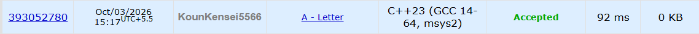

# 🚀 POTD Challenge - Day 1

## 🧩 Problem: Letter

- **Difficulty:** 800 Rating

---

## 📌 Problem

Given a rectangular grid containing shaded (`*`) and unshaded (`.`) squares, find the **smallest rectangle** that contains all the shaded squares.

The sides of the rectangle must remain parallel to the sides of the original grid.

### Example

**Input:**
```text
6 7
.......
..***..
..*....
..***..
..*....
..***..
```

**Output:**
```text
***
*..
***
*..
***
```

---

## ⏱️ Time Complexity

**O(n × m)**

---

## 💾 Space Complexity

**O(n × m)**

---

## 💻 Solution

```cpp
#include <iostream>
#include <vector>
using namespace std;

int main() {

    int n, m;
    cin>>n>>m;

    int min_x1 = m;
    int min_y1 = n;
    int max_x2 = 0;
    int max_y2 = 0;

    vector<vector<char>> rectangles(n, vector<char>(m));

    for(int i=0; i<n; i++){
        for(int j=0; j<m; j++){
            cin>>rectangles[i][j];
            if(rectangles[i][j] == '*'){
                min_x1 = min(min_x1, j);
                min_y1 = min(min_y1, i);
                max_x2 = max(max_x2, j);
                max_y2 = max(max_y2, i);
            }
        }
    }

    for(int i=min_y1; i<=max_y2; i++){
        for(int j=min_x1; j<=max_x2; j++){
            cout<<rectangles[i][j];
        }
        cout<<endl;
    }

    return 0;
}
```

---

## 📸 Acceptance Screenshot

