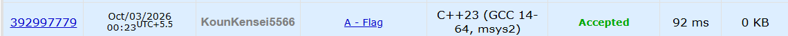

# **🚀 POTD Challenge - Day 2**

## **🧩 Problem: Flag**

- **Difficulty:** 800 Rating

---

## **📌 Problem**

Given a rectangular flag of size `n × m`, check whether it follows the required striped pattern:

- Every horizontal row must contain squares of the **same colour**.
- Adjacent horizontal rows must have **different colours**.

Output `YES` if the flag satisfies these conditions, otherwise output `NO`.

### **Example**

**Input:**
```text
3 3
000
111
222
```

**Output:**
```text
YES
```

---

## **⏱️ Time Complexity**

**O(n × m)**

---

## **💾 Space Complexity**

**O(n × m)**

---

## **💻 Solution**

```cpp
#include <iostream>
#include <vector>
using namespace std;

int main() {

    int n, m;
    cin>>n>>m;

    vector<vector<char>> flag(n, vector<char>(m));

    for(int i = 0; i < n; i++) {
        for(int j = 0; j < m; j++) {
            cin>>flag[i][j];

            if(j > 0 && flag[i][j] != flag[i][j-1]) {
                cout<<"NO"<<endl;
                return 0;
            }
        }

        for(int j = 0; j < m; j++) {
            if(i > 0 && flag[i][j] == flag[i-1][j]) {
                cout<<"NO"<<endl;
                return 0;
            }
        }
    }

    cout<<"YES"<<endl;
    return 0;

}
```

---

## **📸 Acceptance Screenshot**


