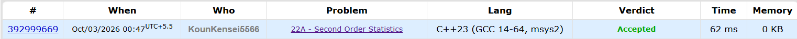

# 🚀 POTD Challenge - Day 3

## 🧩 Problem: Second Order Statistics

- **Difficulty:** 800 Rating

---

## 📌 Problem

Given a sequence of `n` integers, find the **second order statistic**.

The second order statistic is the smallest element that is strictly greater than the minimum.

If the sequence does not have a second order statistic, output `NO`.

### Example

**Input:**
```text
4
1 2 2 -4
```

**Output:**
```text
1
```
---

## ⏱️ Time Complexity

**O(n)**

---

## 💾 Space Complexity

**O(n)**

---

## 💻 Solution

```cpp
#include <iostream>
#include <vector>
#include <algorithm>
using namespace std;

int main() {

    int n;
    cin>>n;

    int secondOrderStatistics = 101;
    int minimum = 100;

    vector<int> seq(n);

    for(int i = 0; i < n; i++) {
        cin>>seq[i];
    }

    for(int i = 0; i < n; i++) {
        if(seq[i] < minimum) {
            minimum = seq[i];
        }
    }

    for(int i = 0; i < n; i++) {
        if(seq[i] > minimum && seq[i] < secondOrderStatistics) {
            secondOrderStatistics = seq[i];
        }
    }

    if(secondOrderStatistics == 101) {
        cout<<"NO"<<endl;
    } else {
        cout<<secondOrderStatistics<<endl;
    }

    return 0;
}
```

---

## 📸 Acceptance Screenshot

