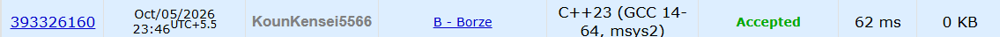

# 🚀 POTD Challenge - Day 5

## 🧩 Problem: Borze

- **Difficulty:** 800 Rating

---

## 📌 Problem

Decode a given Borze code into its corresponding ternary number.

In the Borze alphabet:
- `.` represents digit `0`
- `-.` represents digit `1`
- `--` represents digit `2`

The input is guaranteed to be a valid Borze code.

### Example

**Input:**
```text
.-.--
```

**Output:**
```text
012
```

---

## ⏱️ Time Complexity

**O(n)**

---

## 💾 Space Complexity

**O(n)**

---

## 💻 Solution

```cpp
#include <iostream>

using namespace std;

int main() {

    string code;

    cin>>code;

    string res = "";

    for(int i=0; i<code.length(); i++) {

        if(code[i] == '.') res += '0';
        else if(code[i] == '-' && code[i+1] == '.') {
            res += '1';
            i++;
        }
        else if(code[i] == '-' && code[i+1] == '-') {
            res += '2';
            i++;
        }

    }

    cout<<res;
}
```

---

## 📸 Acceptance Screenshot

