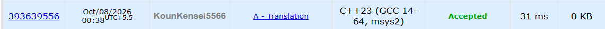

# 🚀 POTD Challenge - Day 8

## 🧩 Problem: Translation

- **Difficulty:** 800 Rating

---

## 📌 Problem

Given two words `s` and `t`, determine whether `t` is exactly the reverse of `s`.

### Example

**Input:**
```text
code
edoc
```

**Output:**
```text
YES
```

---

## ⏱️ Time Complexity

**O(n)**

---

## 💾 Space Complexity

**O(n)**

---

## 💻 Solution

```cpp
#include <iostream>
#include <algorithm>
using namespace std;

int main() {

    string s, t;
    cin>>s>>t;

    reverse(s.begin(), s.end());

    if(s == t) {
        cout<<"YES"<<endl;
    } else {
        cout<<"NO"<<endl;
    }

    return 0;
}
```

---

## 📸 Acceptance Screenshot

