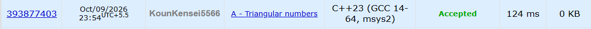

# 🚀 POTD Challenge - Day 9

## 🧩 Problem: Triangular numbers

- **Difficulty:** 800 Rating

---

## 📌 Problem

Given an integer `n`, determine whether it is a triangular number. A triangular number can be represented as the sum of consecutive positive integers starting from `1`, such as `1`, `1 + 2 = 3`, or `1 + 2 + 3 = 6`.

### Example

**Input:**
```text
3
```

**Output:**
```text
YES
```

---

## ⏱️ Time Complexity

**O(√n)**

---

## 💾 Space Complexity

**O(1)**

---

## 💻 Solution

```cpp
#include <iostream>
using namespace std;

int main() {
    int n;
    cin >> n;

    int counter = 1;

    while (n > 0) {
        n -= counter;

        if (n == 0) {
            cout << "YES" << endl;
            return 0;
        }

        counter++;
    }

    cout << "NO" << endl;
    return 0;
}
```

---

## 📸 Acceptance Screenshot

