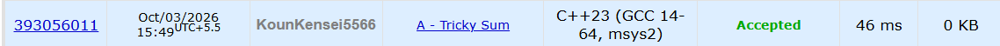

**# 🚀 POTD Challenge - Day 1**

**## 🧩 Problem: Tricky Sum**

- **Difficulty:** 900 Rating

---

**## 📌 Problem**

Calculate the sum of all integers from `1` to `n`, but every **power of two** must be taken with a negative sign.

For example, for `n = 4`:

`-1 - 2 + 3 - 4 = -4`

Calculate the answer for `t` different values of `n`.

**### Example**

**Input:**
```text
2
4
1000000000
```

**Output:**
```text
-4
499999998352516354
```

---

**## ⏱️ Time Complexity**

**O(t × log n)**

---

**## 💾 Space Complexity**

**O(1)**

---

**## 💻 Solution**

```cpp
#include <iostream>

using namespace std;

long long calculateSum(long long n) {

    long long totalSum = 1LL * n * (n + 1) / 2;;

    long long lastPower = 1;

    while(lastPower <= n) {
        lastPower *= 2;
    }

    lastPower /= 2;

    long long sumOfAllPowersOf2 = 2 * lastPower - 1;

    long long finalSum = totalSum - (2 * sumOfAllPowersOf2);

    return finalSum;

}

int main() {

    int t;
    cin>>t;

    long long sum = 0;

    for(int i = 0; i < t; i++) {
        long long x;
        cin>>x;

        cout<<calculateSum(x)<<endl;
    }

    return 0;
}
```

---

**## 📸 Acceptance Screenshot**

