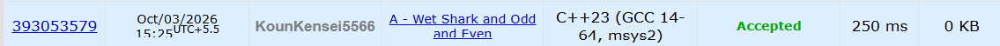

**# 🚀 POTD Challenge — Day 2**

**## 🧩 Problem: Wet Shark and Odd and Even**

- **Difficulty:** 900 Rating

---

**## 📌 Problem**

Given `n` integers, find the **maximum possible even sum** by using each integer at most once.

If no integers are selected, the sum is `0`.

**### Example**

**Input:**
```text
3
1 2 3
```

**Output:**
```text
6
```

---

**## ⏱️ Time Complexity**

**O(n log n)**

---

**## 💾 Space Complexity**

**O(n)**

---

**## 💻 Solution**

```cpp
#include <iostream>
#include <vector>
#include <algorithm>
#include <numeric>
using namespace std;

int main() {

    int n;
    cin>>n;

    vector<long long> odd;

    long long evenSum = 0;

    for(int i = 0; i < n; i++) {
        long long x;
        cin>>x;

        if(x%2 ==0) {
            evenSum += x;
        } else {
            odd.push_back(x);
        }
    }

    sort(odd.begin(), odd.end());

    long long sum = accumulate(odd.begin(), odd.end(), 0LL);

    if(odd.size() % 2 == 0) {
        evenSum += sum;
    } else {
        evenSum += (sum - odd[0]);
    }

    cout<<evenSum<<endl;

    return 0;
}
```

---

**## 📸 Acceptance Screenshot**

