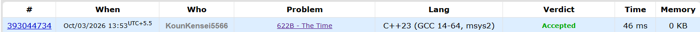

# 🚀 PTD Challenge — Day 4

## 🧩 Problem: [Problem Name]

- **Difficulty:** 900 Rating

---

## 📌 Problem

Given a time in `HH:MM` format and an integer `a`, add `a` minutes to the given time.

The time should wrap around after `23:59` and remain in `HH:MM` format.

### Example

**Input:**
```text
12:30
90
```

**Output:**
```text
14:00
```

---

## ⏱️ Time Complexity

**O(1)**

---

## 💾 Space Complexity

**O(1)**

---

## 💻 Solution

```cpp
#include <iostream>
using namespace std;

int main() {

    string time;
    int a;

    cin>>time;
    cin>>a;

    if(a == 0) cout<<time<<endl;
    else{
        int h = stoi(time.substr(0,2));
        int m = stoi(time.substr(3,2));

        m += a;

        if(m >= 60){
            h += m/60;
            m = m%60;
        }

        if(h >= 24) h = h%24;

        if(h < 10) cout<<"0";
        cout<<h<<":";
        if(m < 10) cout<<"0";
        cout<<m<<endl;
    }

    return 0;
}
```
---

## 📸 Acceptance Screenshot

