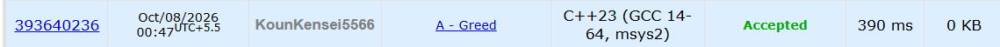

# 🚀 POTD Challenge - Day 8

## 🧩 Problem: Greed

- **Difficulty:** 900 Rating

---

## 📌 Problem

Given `n` cans containing a total amount of cola, determine whether all the remaining cola can be poured into just two cans.

The capacities of the two largest cans are the maximum possible total capacity for storing all the cola.

### Example

**Input:**
```text
2
3 5
3 6
```

**Output:**
```text
YES
```

---

## ⏱️ Time Complexity

**O(n log n)**

---

## 💾 Space Complexity

**O(n)**

---

## 💻 Solution

```cpp
#include <iostream>
#include <vector>
#include <algorithm>
using namespace std;

int main() {

    int n;
    cin>>n;

    vector<int> a(n), b(n);

    for(int i=0; i<n; i++) {
        cin>>a[i];
    }

    for(int i=0; i<n; i++) {
        cin>>b[i];
    }

    sort(b.begin(), b.end());

    long long allRemainingCola = 0;

    for(int i = 0; i < n; i++) {
        allRemainingCola += a[i];
    }

    if(allRemainingCola <= (long long) (b[n-1] + b[n-2])) {
        cout<<"YES"<<endl;
    } else {
        cout<<"NO"<<endl;
    }

    return 0;
}
```

---

## 📸 Acceptance Screenshot

